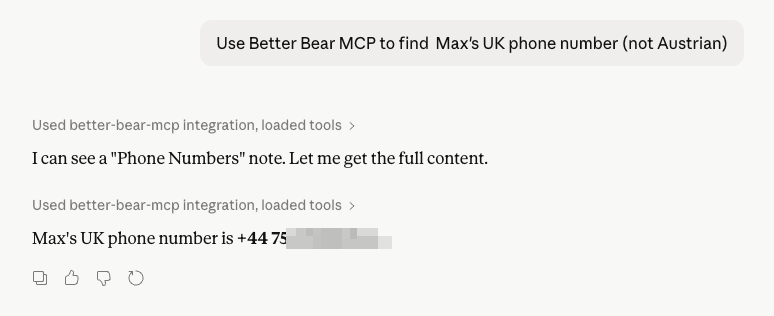

# better-bear-cli

[](https://github.com/mreider/better-bear-cli/actions/workflows/build-on-merge.yml)
[](https://github.com/mreider/better-bear-cli/releases/latest)
[](https://github.com/mreider/better-bear-cli/blob/main/LICENSE)
[](https://buymeacoffee.com/mreider)

A CLI and [MCP server](https://modelcontextprotocol.io/) for [Bear](https://bear.app) notes that talks directly to CloudKit. No SQLite hacking, no x-callback-url. Use it from the terminal or let AI assistants like Claude read, search, create, and edit your Bear notes.

## Why

Bear's x-callback-url API is awkward for programmatic use and direct SQLite access risks database corruption. As markdown notes become central to LLM workflows, Bear needs a real programmatic interface. [More context here.](https://www.reddit.com/r/bearapp/comments/1r1ff7e/comment/o5oa41z/)

This CLI uses the same CloudKit REST API that [Bear Web](https://web.bear.app) uses. It reads and writes safely through Apple's servers, the same way your devices sync.

## Install

### Quick install

```
curl -sL https://raw.githubusercontent.com/mreider/better-bear-cli/main/install.sh | bash
```

### Upgrade

```
bcli upgrade
```

This downloads the latest release and replaces the current binary in-place. After upgrading, run `hash -r` (or open a new terminal) to refresh your shell. If the MCP server was updated, restart Claude Desktop too.

### Download manually

Grab the latest release from [GitHub Releases](https://github.com/mreider/better-bear-cli/releases/latest).

```
curl -L https://github.com/mreider/better-bear-cli/releases/latest/download/bcli-macos-universal.tar.gz -o bcli.tar.gz
tar xzf bcli.tar.gz
mv bcli ~/.local/bin/bcli
rm bcli.tar.gz
```

The binary is universal (arm64 + x86_64). Requires macOS 13+.

### Build from source

Requires Swift 5.9+.

```
git clone https://github.com/mreider/better-bear-cli.git
cd better-bear-cli
swift build -c release
cp .build/release/bcli ~/.local/bin/bcli
```

## Auth

```
bcli auth
```

Opens your browser for Apple Sign-In via CloudKit JS. The token is saved to `~/.config/bear-cli/auth.json`. You can also pass a token directly with `bcli auth --token '<token>'`.

## Commands

```
bcli ls                              List notes
bcli ls --all --tag work --json      Filter by tag, JSON output
bcli get <id>                        View a note with metadata
bcli get <id> --raw                  Just the markdown
bcli tags                            Tag tree
bcli sync                            Sync notes to local cache
bcli sync --full                     Force full re-sync
bcli search "query"                  Full-text search (title, tags, body)
bcli search "query" --since yesterday  Filter by modification date
bcli search "query" --since last-week  Relative dates supported
bcli search "query" --since 2026-01-01 Absolute dates too
bcli create "Title" -b "Body"        Create a note
bcli create "Title" -t "t1,t2"       Create with tags
bcli create "Title" --stdin          Pipe content from stdin
bcli edit <id> --append "text"       Append to a note
bcli edit <id> --append "text" --after "heading"  Insert after a heading
bcli edit <id> --replace-section "heading" --section-content "new text"
bcli edit <id> --editor              Open in $EDITOR
bcli edit <id> --stdin               Replace content from stdin
bcli archive <id>                    Archive a note
bcli archive <id> --undo             Unarchive
bcli trash <id>                      Move to trash
bcli tag add <id> "work"             Add a tag to a note
bcli tag remove <id> "work"          Remove a tag from a note
bcli tag rename "old" "new"          Rename a tag across all notes
bcli tag delete "old-tag"            Remove a tag from all notes
bcli ls --untagged                   List notes with no tags
bcli export ./dir                    Export all notes as markdown
bcli export ./dir --frontmatter      Include YAML metadata
bcli export ./dir --tag work         Export only matching tag
bcli todo                            List notes with incomplete TODOs
bcli todo --limit 10                 Limit results
bcli todo <id>                       View TODOs in a note (interactive toggle)
bcli todo <id> --toggle 3            Toggle item 3 without prompting
bcli todo --json                     JSON output
bcli todo --no-sync                  Skip auto-sync
bcli attach <id> photo.jpg           Attach an image to a note
bcli attach <id> doc.pdf             Attach any file
bcli attach <id> img.png --prepend   Insert after the title
bcli attach <id> img.png --after "Profile"   Insert after a heading or text
bcli attach <id> img.png --before "Footer"   Insert before a heading or text
```

### Attaching images and files

`bcli attach` uploads files to iCloud and embeds them in the note's markdown. Images (jpg, png, gif, webp, heic, svg) render inline in Bear. Other files (pdf, zip, txt, etc.) appear as embedded attachments.

By default, attachments are appended to the end of the note. Use placement options to control where:

- `--prepend` — right after the title line
- `--after "text"` — after the first line containing "text" (matches headings like `## text` too)
- `--before "text"` — before the first line containing "text"
- `--at-line N` — after line N (1-based)

### YAML front matter

Bear supports [YAML front matter](https://community.bear.app/t/yaml-front-matter-uses-in-bear/13105) — a `---` delimited metadata block at the top of a note. Bear collapses it in the editor. Use it for status tracking, project metadata, blog publishing fields, or any custom key-value data.

**Create with front matter:**

```
bcli create "Meeting Notes" --fm "status=draft" "project=alpha" "date=2026-04-11"
```

This produces:
```yaml
---
status: draft
project: alpha
date: 2026-04-11
---
# Meeting Notes
```

**Read front matter** (included automatically in JSON output):

```
bcli get <id> --json
```
```json
{
  "title": "Meeting Notes",
  "frontmatter": {"status": "draft", "project": "alpha", "date": "2026-04-11"},
  "text": "..."
}
```

**Edit front matter fields** without touching the note body:

```
bcli edit <id> --set-fm "status=done" "reviewed=true"
bcli edit <id> --remove-fm "draft"
```

**Export** merges user front matter with Bear metadata (id, dates, tags) — user fields take precedence.

## How it works

Bear Web is a CloudKit JS client that talks to `api.apple-cloudkit.com`. There is no Shiny Frog backend. Notes live in your iCloud private database under the container `iCloud.net.shinyfrog.bear` in a custom zone called `Notes`.

This CLI makes the same REST API calls Bear Web makes: `records/query`, `records/lookup`, `records/modify`, and `assets/upload`. Authentication uses the same iCloud web auth token flow.

Three record types: `SFNote` (notes), `SFNoteTag` (tags), `SFNoteBackLink` (wiki links between notes).

## MCP Server (Claude Desktop)

better-bear-cli includes an MCP server that exposes all Bear commands as tools in [Claude Desktop](https://claude.ai/download). This lets Claude read, search, create, and edit your Bear notes directly.



### Setup

```
# Build the MCP server
cd mcp-server && npm install && npm run build && cd ..

# Install into Claude Desktop config
bcli mcp install

# Restart Claude Desktop — Bear tools should appear
```

To remove it later: `bcli mcp uninstall`

### Available tools

| Tool | Description |
|------|-------------|
| `bear_sync` | Sync notes from iCloud |
| `bear_list_notes` | List notes with optional tag filter |
| `bear_get_note` | Get a note's full content by ID |
| `bear_search` | Full-text search across notes |
| `bear_get_tags` | Get the full tag hierarchy |
| `bear_create_note` | Create a new note with optional front matter |
| `bear_edit_note` | Append, replace content, or edit front matter fields |
| `bear_attach_file` | Upload and attach an image or file to a note |
| `bear_archive_note` | Archive or unarchive a note |
| `bear_trash_note` | Move a note to trash |
| `bear_add_tag` | Add a tag to a note |
| `bear_remove_tag` | Remove a tag from a note |
| `bear_rename_tag` | Rename a tag across all notes |
| `bear_delete_tag` | Delete a tag from all notes |
| `bear_find_untagged` | List notes with no tags |
| `bear_list_todos` | List notes with incomplete TODOs |
| `bear_get_todos` | Get TODO items from a specific note |
| `bear_toggle_todo` | Toggle a TODO item's completion |

The `bear_attach_file` tool accepts optional `after`, `before`, or `prepend` parameters to control where the attachment is inserted in the note. The `bear_create_note` and `bear_edit_note` tools support YAML front matter via `frontmatter`, `set_frontmatter`, and `remove_frontmatter` parameters — Claude can create notes with structured metadata and update individual fields without touching the note body.

Notes with `locked: true` in results are private/encrypted in Bear -- their body content may not be searchable.

This is under active development. Please try it out and [open an issue](https://github.com/mreider/better-bear-cli/issues) if you run into problems.

## Safe to use with Bear open

The CLI does not touch Bear's local SQLite database. It talks to CloudKit's cloud servers. Running the CLI while Bear is open is no different from having Bear open on two devices at once. CloudKit handles concurrency with optimistic locking via `recordChangeTag`.

## Contributors

<a href="https://github.com/mreider"></a>
<a href="https://github.com/program247365"></a>
<a href="https://github.com/asabirov"></a>
<a href="https://github.com/darronz"></a>

## Support

If you find this useful, consider [buying me a coffee](https://buymeacoffee.com/mreider) to help cover API token costs.
